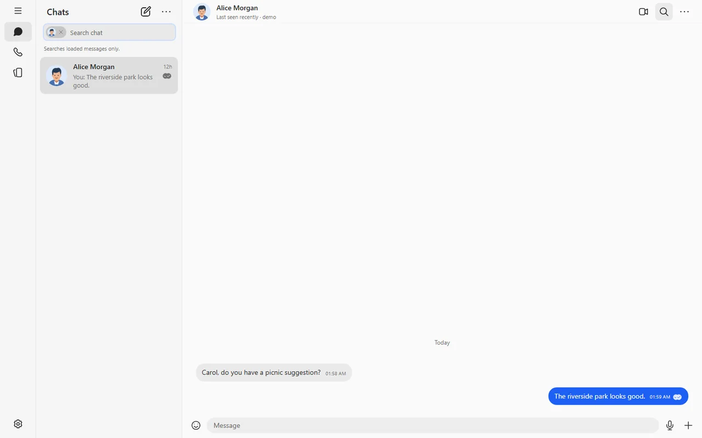
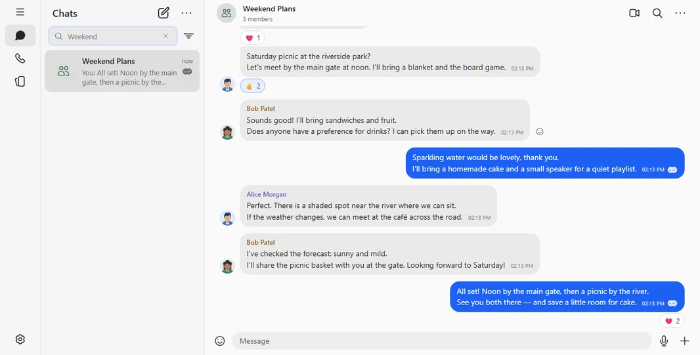
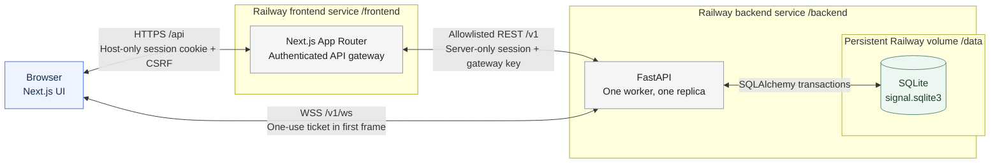
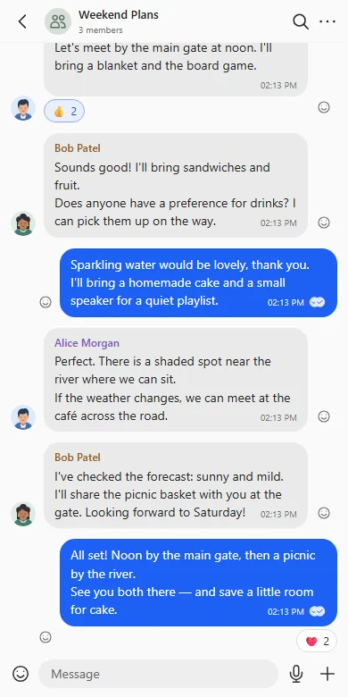

# Signal-inspired Messenger

An original, full-stack messaging application built for the **Scaler SDE Fullstack assignment**. A Signal Desktop-inspired interface backed by authenticated real-time messaging, relational SQLite storage and a durable Railway deployment.

**[Live Demo](https://frontend-production-5f84.up.railway.app/)** · **[Source Code](https://github.com/Harshpreet1729/scaler-signal-clone)** · **[Backend Health](https://backend-production-5383.up.railway.app/v1/health/live)**



*Real application captures using fictional demo accounts. This is an independent assignment project, not an official Signal client.*

## Feature highlights

- **Direct and group conversations** — live text messages, persistent history, recent-chat ordering, last-message previews and unread badges.
- **Message feedback** — sending/sent/delivered/read progression, recipient acknowledgments, typing indicators and incoming-message toasts.
- **Group administration** — create and rename groups, view members, and enforce admin-only additions/removals on the server.
- **Emoji reactions** — six choices, live counts, toggle your own reactions, and recover state after refresh/reconnect.
- **Contacts and search** — find demo users, add contacts, filter unread conversations and search loaded history through the sidebar.
- **Profiles and sessions** — fixed-OTP registration/login, persisted sessions, logout, editable display names and four original portrait presets.
- **Desktop and mobile layouts** — navigation rail, sidebar New Chat, full in-app Settings, accessible dialogs and responsive chat navigation.

<details>
<summary><strong>Group messaging and reactions</strong></summary>



*A fictional picnic exchange in Weekend Plans, sent through three independent demo sessions with live reaction counts.*

</details>

## Tech stack

| Layer | Technology | Responsibility |
| --- | --- | --- |
| Frontend | Next.js 16 · React 19 · TypeScript | App Router UI, forms and authenticated REST gateway |
| Backend | Python 3.13 · FastAPI · Uvicorn | Sessions, authorization, validation and WebSockets |
| Persistence | SQLite · SQLAlchemy · Alembic | Relational data, transactions and versioned migrations |
| Real time | Native browser WebSocket API | Messages, receipts, typing and reactions |
| Quality | pytest · Playwright · ESLint · TypeScript | Backend correctness, real-browser flows and static checks |
| Hosting | Railway | Separate frontend/backend services and a persistent SQLite volume |

Dependencies are pinned in `frontend/package-lock.json` and `backend/requirements.txt`. No Redis, message broker or external authentication provider is required.

## System architecture



**REST goes through Next.js; WebSockets connect directly to FastAPI.** The browser first obtains a short-lived, single-use WebSocket ticket through the authenticated gateway. Long-lived session credentials never appear in browser storage or WebSocket URLs.

Sessions use host-only **HttpOnly, SameSite=Lax** cookies, **Secure** over HTTPS; only token hashes are stored in SQLite. Mutations require the exact frontend Origin and session CSRF token. Every conversation operation checks active membership, and admin controls are enforced on the backend.

SQLite commits precede real-time publication. Client message UUIDs prevent duplicate sends; versioned reaction snapshots prevent stale updates. Reconnect/foreground recovery reconciles REST history and receipts. Socket fan-out and mutation coordination are process-local, so production requires **one backend worker and one replica**.

### Mobile experience



*The same application adapts to a conversation list, focused chat and mobile back navigation.*

## Quick start

### Prerequisites

- **Node.js 24.13+ within 24.x** and **npm 11.x**.
- **Python 3.13**; verified locally with 3.13.12.
- Git. Chromium is required only for browser tests.

Clone and enter the repository:

```sh
git clone https://github.com/Harshpreet1729/scaler-signal-clone.git
cd scaler-signal-clone
```

### Install and initialize locally — Windows / PowerShell

```powershell
Set-Location backend
py -3.13 -m venv .venv
.\.venv\Scripts\python.exe -m pip install -r requirements.txt
.\.venv\Scripts\python.exe -m app.configure_local
.\.venv\Scripts\python.exe -m alembic upgrade head
.\.venv\Scripts\python.exe -m app.seed

Set-Location ../frontend
npm ci
```

`app.configure_local` creates ignored frontend/backend `.env` files with a matching random server-only gateway key. It preserves existing matching files and refuses conflicting configuration. Review an existing `.env.local`, which takes precedence in Next.js. Never commit environment files or expose `INTERNAL_API_KEY` with a `NEXT_PUBLIC_` prefix.

Start the servers in **two terminals**, from the repository root:

```powershell
# Terminal 1 — backend
Set-Location backend
.\.venv\Scripts\python.exe -m app
```

```powershell
# Terminal 2 — frontend
Set-Location frontend
npm run dev
```

Open **[http://127.0.0.1:3000](http://127.0.0.1:3000)**. FastAPI runs at `http://127.0.0.1:8000`; the frontend health route is `/api/health/live`, forwarding to backend `/v1/health/live`. Use `127.0.0.1` consistently, rather than mixing it with `localhost`.

<details>
<summary>macOS / Linux equivalent</summary>

From the repository root:

```sh
cd backend
python3.13 -m venv .venv
.venv/bin/python -m pip install -r requirements.txt
.venv/bin/python -m app.configure_local
.venv/bin/python -m alembic upgrade head
.venv/bin/python -m app.seed
cd ../frontend
npm ci
```

In separate terminals, run `.venv/bin/python -m app` from `backend/`, and `npm run dev` from `frontend/`. These portable command equivalents have not been independently verified on macOS/Linux.

</details>

### Try the demo

| Username | Fictional display name | Seed role |
| --- | --- | --- |
| `alice` | Alice Morgan | Admin of Weekend Plans |
| `bob` | Bob Patel | Direct contact and group member |
| `carol` | Carol Chen | Direct contact and group member |
| `dave` | Dave Rivera | Available demo contact; outside the initial group |

**Public demo OTP: `123456`.** Choose **Log in** for a seed account, or register a new username (3–32 letters/numbers/underscores), display name and preset avatar. Registration signs you in; a fresh account starts with no conversations.

Use separate browser profiles or an incognito window for two users. Open a direct chat or Weekend Plans, send a message, observe typing/receipts, then add a reaction. **Enter** sends; **Shift+Enter** inserts a newline. Settings → Profile saves your display name/avatar and provides logout. Reload and sign in again to check persistence.

> The OTP is deliberately public: anyone can sign into these demo accounts. Use fictional data only. This application does **not** implement real end-to-end encryption.

## Database and API

### Relational storage

| Table | Purpose / key invariant |
| --- | --- |
| `users` | Unique normalized username, display name and allowlisted avatar key |
| `auth_challenges`, `sessions` | Challenge expiry/attempts and hashed, revocable session credentials |
| `contacts` | Directional owner/contact relationship; no duplicate or self-contact |
| `conversations` | Named group or unique canonical direct-user pair |
| `conversation_members` | Composite conversation/user key, member/admin role, join/removal history |
| `messages` | Stable history ID; unique sender/client UUID makes retries idempotent |
| `message_receipts` | One row per original message recipient; read implies delivered |
| `message_reactions` | Unique message/user/emoji tuple prevents duplicate reactions |

Foreign keys, WAL, indexed history/unread queries and a busy timeout support concurrent clients. Canonical `(lower_user_id, higher_user_id)` uniqueness prevents duplicate direct threads. Groups retain historical membership: new active members can read full history; removed members lose server and socket access. Receipt cohorts are fixed at send time, so a removed recipient can leave an older message partially acknowledged.

Alembic revisions `0001` and `0002` create the base schema and additive reactions support. Explicit seeding inserts missing fictional fixtures without resetting existing edits. See the [schema design](docs/DATABASE_DESIGN.md), [actual models](backend/app/models.py) and [reaction migration plan](docs/REACTIONS_MIGRATION_PLAN.md).

### REST contracts

The browser uses `/api`; the gateway forwards fixed operations to backend `/v1`. Private responses are not cached. Most authenticated mutations require JSON and `X-CSRF-Token` in addition to the session cookie.

| Method and path after the prefix | Operation |
| --- | --- |
| `GET /health/live` | Public liveness check |
| `POST /auth/challenges`, `/auth/register`, `/auth/login` | Fixed-OTP onboarding |
| `GET /auth/me`, `POST /auth/logout` | Restore or revoke the current session |
| `PATCH /users/me` | Save `display_name` and `avatar_key` |
| `GET /users`, `GET/POST /contacts` | Search demo users; list/add contacts |
| `GET /conversations`, `POST /conversations/direct` | Recent/unread list; get or create a direct thread |
| `POST /conversations/groups`, `GET/PATCH /conversations/{id}` | Create/view a group; admin rename |
| `GET/POST /conversations/{id}/members`, `DELETE /conversations/{id}/members/{userId}` | View membership; admin add/remove |
| `GET/POST /conversations/{id}/messages` | Paginated history; send text with a stable client UUID |
| `POST /conversations/{id}/delivered`, `/read` | Acknowledge eligible original message receipts |
| `POST /conversations/{id}/reactions` | Set own emoji reaction state with `{message_id, emoji, active}` |
| `POST /auth/ws-ticket` | Mint a one-use, 30-second WebSocket ticket |

Backend OpenAPI is available locally at `http://127.0.0.1:8000/docs`. Credential-bearing backend routes also require the server-only gateway key; use the frontend for normal authentication.

### WebSocket events

`/v1/ws` validates the exact Origin and requires the one-use ticket in the first authentication frame. Events include `message.send`, `message.accepted`, `message.created`, `conversation.updated`, `membership.removed`, `receipt.updated`, `typing.set`, `typing.changed`, `reaction.updated` and heartbeat `ping`/`pong`. Server identity and timestamps are authoritative. Typing expires automatically; missed message/receipt/reaction updates recover through REST reconciliation.

### Production configuration

| Variable | Service | Purpose |
| --- | --- | --- |
| `BACKEND_BASE_URL` | Next.js only | Fixed server-side FastAPI REST origin |
| `NEXT_PUBLIC_WS_URL` | Next.js build | Public credential-free `wss://.../v1/ws` URL |
| `FRONTEND_ORIGIN` | Both | Exact frontend HTTPS origin |
| `INTERNAL_API_KEY` | Both, server-only | Matching gateway credential; never public |
| `DATABASE_PATH` | FastAPI | `/data/signal.sqlite3` on the persistent volume |
| `PORT` | Each service | Railway-provided listening port |

The frontend starts with `npm run start:production`; the backend with `python -m app.startup`. Backend startup binds `0.0.0.0:$PORT`, validates mounted storage and runs Alembic **after the volume mounts**, before Uvicorn starts. A failed migration prevents startup. Seeds are explicit and never run on every start. Existing deployments must preserve the volume; follow the [Railway deployment plan](docs/RAILWAY_DEPLOY_PLAN.md) and approved backup/rollback procedure before changing an existing database.

## Testing

```powershell
# From backend/
.\.venv\Scripts\python.exe -m pytest

# From frontend/ — install Chromium once
npx playwright install chromium
npm run lint
npm run typecheck
npx playwright test
npm run build
```

Playwright starts real Next.js and FastAPI services on ports **3100/8100**, migrates/seeds a **temporary test SQLite database**, and uses independent browser contexts. It does not use the developer or production database. Backend tests cover authorization, transactions, WebSocket behavior, membership and reaction integrity; browser tests exercise onboarding, messaging, groups, receipts, search, reactions and responsive navigation.

The latest profile release passed **four targeted desktop/mobile profile tests**, lint, typecheck and production build. Public checks verified saves/reloads/new logins, two-user messaging, typing, read receipts, live reaction counts and persistence after refresh. Historical full-suite evidence is linked below; documentation-only updates do not rerun or imply a new full-suite pass.

Browser tests use Next dev and can replace `.next` artifacts. Rebuild before `npm run start` to review production locally, and do not run dev and production against the same build directory. Chromium on Windows is verified; other browser engines and operating systems are not claimed as tested.

## Limitations and design choices

- **No real E2EE or real SMS/OTP delivery.** This is an educational demo with impersonable fixed-OTP accounts.
- Online/last-seen presence is mocked. Calls, stories, linked devices, composer attachments/emoji insertion and privacy/notification/appearance preferences are labeled placeholders.
- Quoted replies, file uploads, dark mode and disappearing messages are not implemented. Message reactions are implemented.
- Sidebar message search covers **loaded history**; it is not a server-wide full-text index.
- Pending drafts/retry state are in memory. Refresh restores committed messages, not unsent drafts.
- WebSocket fan-out, ticket state and rate limiting are process-local. The current deployment does not support multiple backend workers/replicas.
- Profile edits update the signed-in user's UI immediately; other clients obtain updated profile data on a normal refresh.

## Project map and documentation

```text
frontend/       Next.js UI, API gateway, portrait assets and Playwright tests
backend/        FastAPI routes/services, relational models, Alembic and pytest
  app/startup.py  Production storage validation, migrations and single-worker startup
docs/           Requirements, architecture, QA and deployment procedures
```

- [Assignment acceptance checklist](docs/REQUIREMENTS.md) · [Acceptance scenarios](docs/ACCEPTANCE_TESTS.md)
- [Architecture decisions](docs/ARCHITECTURE.md) · [Database design](docs/DATABASE_DESIGN.md)
- [Approved visual reference](docs/SIGNAL_UI_REFERENCE.md) · [Signal fidelity QA](docs/SIGNAL_FIDELITY_QA.md)
- [Phase 5 validation](docs/PHASE_5_HANDOFF.md) · [Production verification](docs/PHASE_5_DEPLOYMENT.md) · [Phase 6 QA](docs/PHASE_6_QA.md)
- [Railway deployment recipe](docs/RAILWAY_DEPLOY_PLAN.md) · [Reaction migration and rollback](docs/REACTIONS_MIGRATION_PLAN.md)

Some design documents describe the original plan or historical release gates. The current source and this README describe the shipped application.
